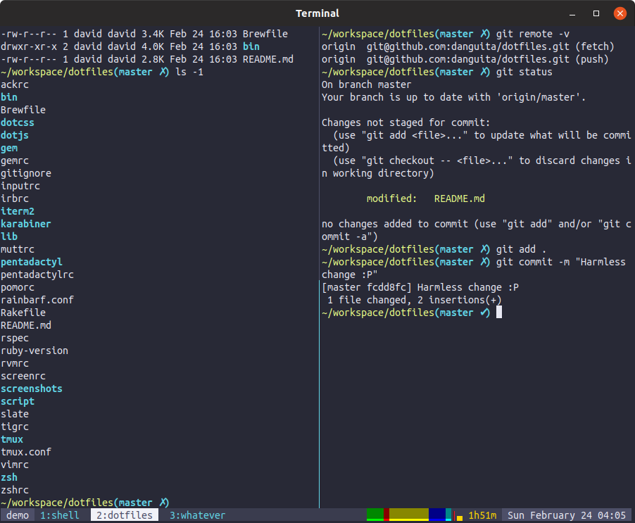
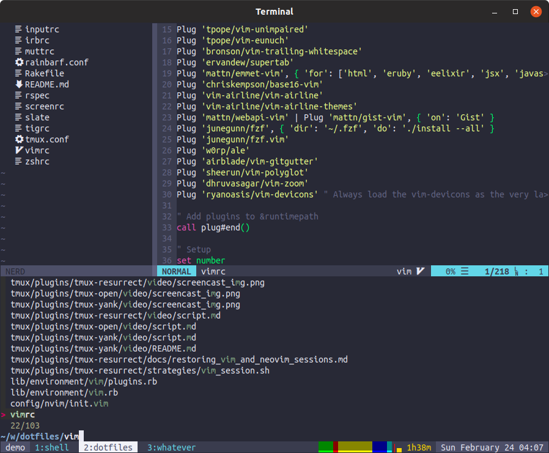

# @danguita's dotfiles

## Overview of files

- Vim (text editor): `vimrc`.
- Tmux (terminal multiplexer): `tmux.conf`.
- Zsh (interactive shell): `zshrc`.
- Ack/The silver searcher (code search tooling): `ackrc`.
- Tig (git client): `tigrc`.
- Mutt (email client): `muttrc`.
- Readline config: `inputrc`.

## How does it look?




## Installation

### Disclaimer

Don't blindly use these dotfiles unless you know what that entails!

### Requirements

Only `ruby` and `rake` are required.

```
$ mkdir ~/workspace
$ git clone https://github.com/danguita/dotfiles.git ~/workspace/dotfiles
$ cd ~/workspace/dotfiles
$ rake install
```

### Update an existing install

```
$ rake update
```

### All tasks

```
rake dotfiles:install # Install dotfiles
rake dotfiles:update  # Update dotfiles
rake install          # Install dotfiles and related libraries
rake shell:install    # Install Oh-My-Zsh and change default shell
rake shell:update     # Update Oh-My-Zsh
rake update           # Update dotfiles, vim and shell libraries
rake vim:install      # Install Vim plugins
rake vim:update       # Update Vim plugins
```

## Feel free to leave your feedback

Any feedback is [very welcomed](https://github.com/danguita/dotfiles/issues)!
