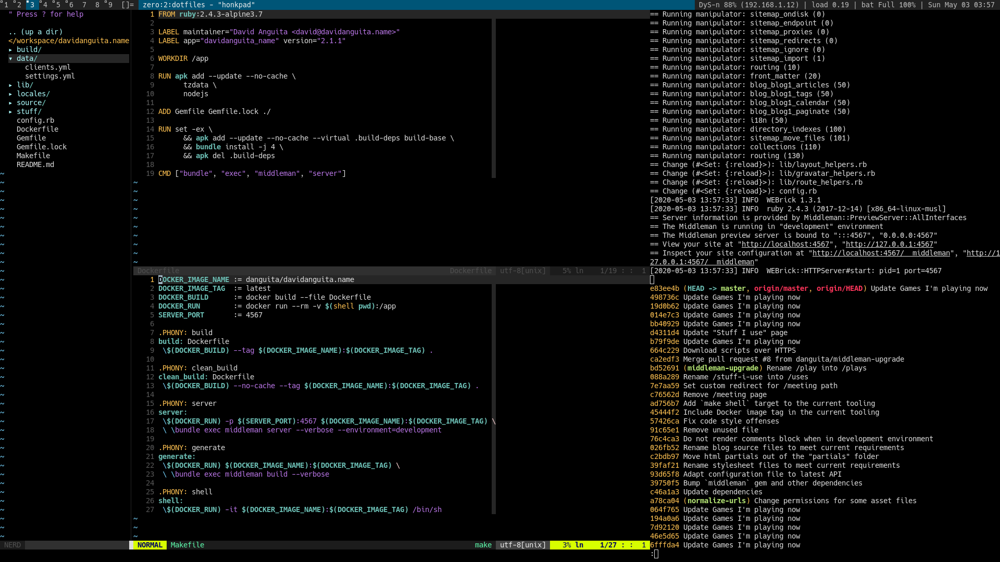

# @danguita's dotfiles [](https://travis-ci.org/danguita/dotfiles)

## Overview

Here is a blog post describing some of the key parts of this setup:

https://davidanguita.name/articles/the-postmodern-development-environment/

## How does it look like?



Note: This is rxvt-unicode on dwm.

## Usage

### Disclaimer

Please, don't blindly use these dotfiles unless you know what that
entails!

### Installation

```
$ mkdir -p ~/workspace
$ git clone --recurse-submodules https://github.com/danguita/dotfiles.git ~/workspace/dotfiles
$ make -C ~/workspace/dotfiles install
```

### Update an existing install

```
$ make update
```

### All tasks

```
make install           Install dotfiles and vim configuration.
make update            Update dotfiles and vim configuration.
make clean             Remove dotfiles and vim configuration.
make dotfiles-install  Create symlinks.
make dotfiles-update   Update remote.
make dotfiles-clean    Remove symlinks.
make vim-install       Install plugin manager and plugins.
make vim-update        Update plugin manager and plugins.
make vim-clean         Remove plugin manager and plugins.
make help              This help.
```

## Feedback

Any feedback is [more than welcome](https://github.com/danguita/dotfiles/issues).

## See also

- [scripts](http://github.com/danguita/scripts)
