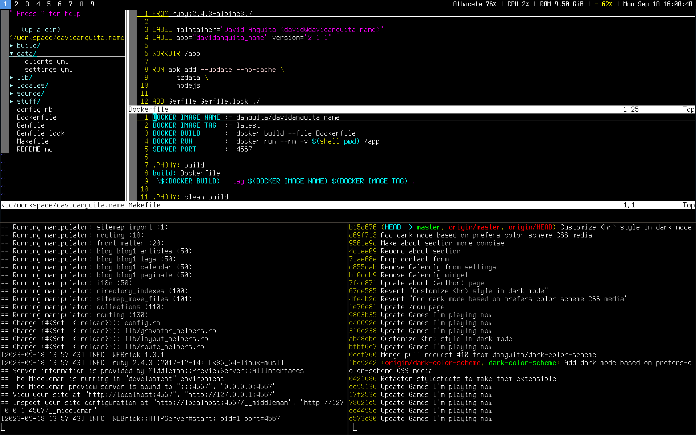

# @danguita's dotfiles

## Overview of files

- Vim (text editor): `vimrc`.
- Tmux (terminal multiplexer): `tmux.conf`.
- Zsh (interactive shell): `zshrc`.
- dwm (window manager): `dwm/config.h`.
- Ack/The silver searcher (code search tool): `ackrc`.
- Tig (git client): `tigrc`.
- Readline config: `inputrc`.

## How does it look like?



Note: This is rxvt-unicode on dwm.

## Usage

### Disclaimer

Please, don't blindly use these dotfiles unless you know what that
entails!

### Requirements

Ruby (`rake`) is required in order to execute the installation scripts.

### Installation

```
$ mkdir ~/workspace
$ git clone https://github.com/danguita/dotfiles.git ~/workspace/dotfiles
$ cd ~/workspace/dotfiles
$ rake install
```

### Update an existing install

```
$ rake update
```

### All tasks

```
rake dotfiles:cleanup  # Clean up dotfiles
rake dotfiles:install  # Install dotfiles
rake dotfiles:update   # Update dotfiles
rake install           # Install dotfiles and related libraries
rake shell:install     # Install Oh-My-Zsh and change default shell
rake shell:update      # Update Oh-My-Zsh
rake update            # Update dotfiles and related libraries
rake vim:install       # Install Vim plugins
rake vim:update        # Update Vim plugins
```

## Feedback

Any feedback is [more than welcomed](https://github.com/danguita/dotfiles/issues).

## License

This is just configuration files, feel free to use any of them.
